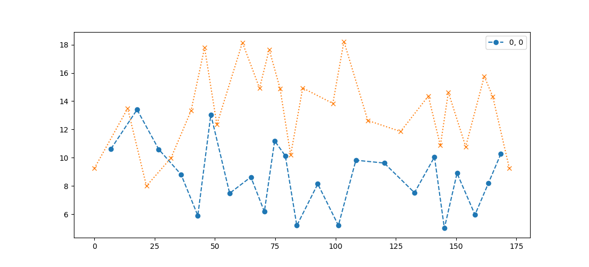
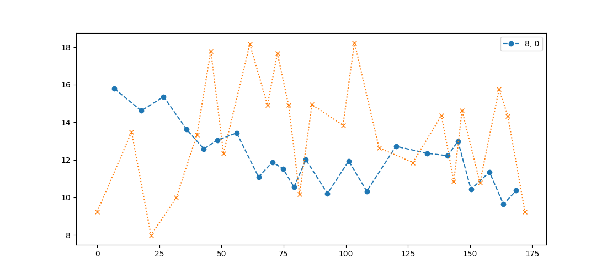
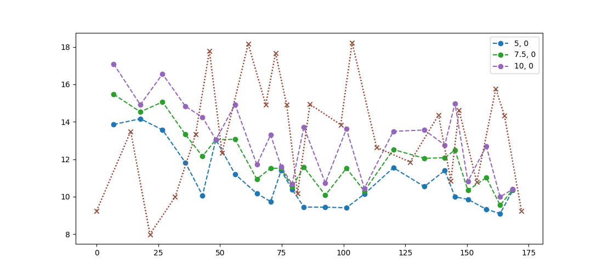
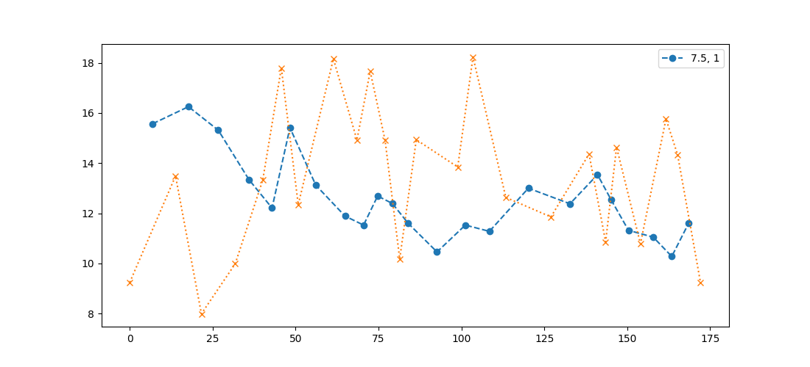

# Normalisation de la vitesse en trail

## Motivations

Pratiquant le trail, j'étais à la recherche d'un outil pouvant prédire mes temps de passage à différent point du parcours en fonction des statistiques que sont la distance, le dénivelé, la technicité du terrain, de la météo, de l'état de forme... 

Avant de pouvoir réellement créer un prédicteur, il s'agit d'abord d'étudier l'influence des paramètres sur la performance. Il vient alors l'idée de créer une vitesse normalisée que le terrain soit plat ou vallonée afin de pouvoir ensuite étudier le ralentissement et la gestion durant l'effort.

Il s'agit dans un premier temps de créer un modèle simple, et de ne pas invoquer des moyens mathématiques/statistiques important. 

## Inspirations

Cette idée n'est pas née toute seule. Je relève notamment la valeur "vitesse à plat" créé par Strava qui suit cette philosophie. Il existe également des sites internet qui propose de prévoir des temps, mais ceux-ci semblent assez obsolètes.

## Choix de la course

Pour créer un vitesse normalisée, il faut étudier un cas concret.
Il faut donc séléctionner une course avec du dénivelé (un maximum de dénivelé !), avec une distance assez longue pour avoir beaucoup d'information avec uniquement une seule course.
Il faut ensuite que l'(les)athlète(s) que l'on étudie soit le plus constant possible. (Si à chaque ravitaillement, l'athlète fait entre 5 et 60 minutes de pauses, le modèle qui s'applique sur la partie course n'a plus de sens)

Tous ces facteurs m'ont amené à étudier la course de Francois D'Haène sur l'UTMB en 2021.

Et afin d'affûter le modèle, on pourra ensuite utiliser d'autres athlètes.

## Model n°1

Traçons tout d'abord la courbe de vitesse moyenne sur chaque section sans ajuster la vitesse :

On remarque que la courbe est en dent de scie, c'est cohérent car cela va plus vite en descente qu'en montée.

Essayons donc de corriger cela et d'inclure le dénivelé positif dans la vitesse moyenne. On créé une nouvelle distance :

où D est la nouvelle distance, d la distance en km, e+ est le dénivelé positif, et a un coefficient à trouver pour que la courbe deviennent plus lisse.

***

Avec un coefficient de 8, on trouve la courbe suivante : 

C'est beaucoup mieux, la courbe est plus lisse et on dicerne une tendance générale plus facilement. Il reste par contre des bosses dans la plupart des montées (km85, km100, km145), on pourrait se dire que ces bosses apparaissent à cause d'un coefficient a trop élevé, mais il s'avère qu'en réduisant la courbe n'est plus si lisse que cela... :

***

Pour résoudre ce souci je fais un constat simple, les descentes sur l'UTMB paraissent souvent plus technique que les portions de plat (gros chemin, bitume). Je décide donc d'ajouter également un coefficient pour le dénivelé négatif.

 devient donc 

Et on obtient ceci :

La courbe s'est lissé... mais pas partout ! Pourquoi ?

1) Même à ce niveau professionel, l'athlète ne peut conserver un effort constant tout du long, et doit composer avec les éléments.
2) On remarque que les anomalies trouvent des causes (tous cela n'est qu'interprétation, cela peut s'avérer faux):
   1) La première descente est à vitesse très élevée, c'est également vrai en réalité, elle se fait sur un terrain non-technique au possible, ce qui la rend donc très facile.
   2) Le rythme baisse rapidement dans les 40 premiers kilomètres : c'est ce qu'on ressent aussi dans la course, il y a toujours un départ "rapide".
   3) La descente aux Chapieux au kilomètre 45 se fait à vive allure. Là cela me paraissait bizarre car c'est le début de la nuit, donc cela devrait ralentir... Après être allé voir l'activité Strava de Francois, je me suis rendu compte qu'il avait le 5ème meilleur temps sur le segment de la descente... le jour de la course ! Quoi de plus normal de voir donc une telle allure normalisée !
   4) Ensuite on ressent un ventre creux, ce qui correspond à la nuit.
   5) Puis on voit que sur la fin de la descente sur La Fouly, l'allure remonte (km120) : cela correspond au lever du jour.
   6) Sur les 3 dernières bosses, l'allure diminue, la fatigue se fait ressentir...